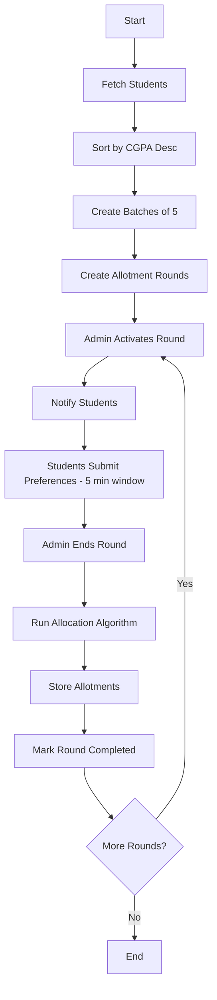
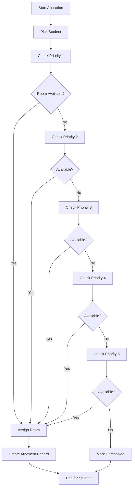
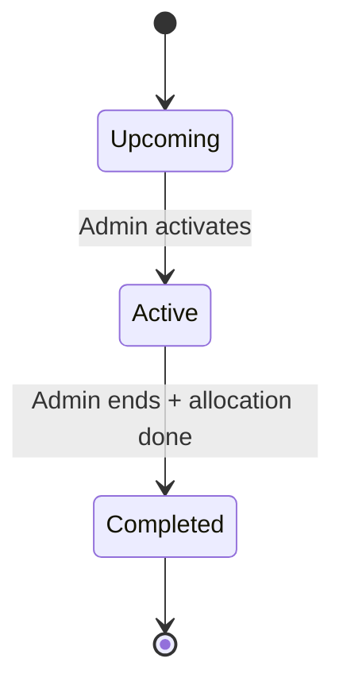
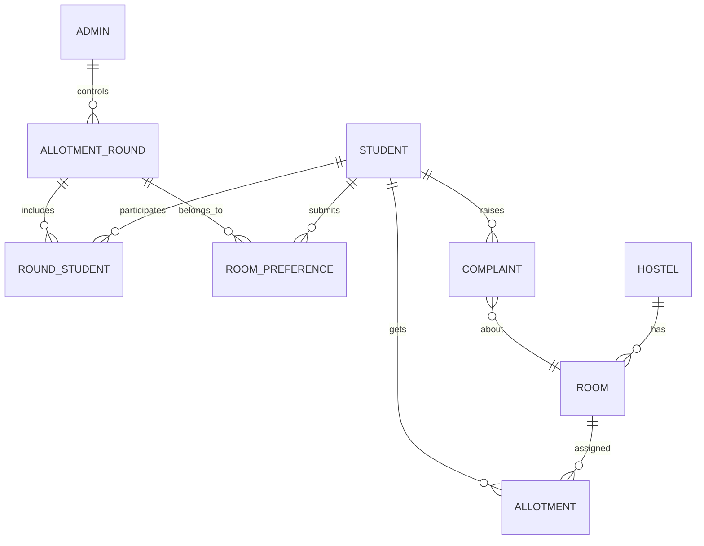

# Hostel Allotment System 

---

## 1. Overview

The **Hostel Allotment System** is a database-driven application designed to simulate a **real-world hostel allocation process using CGPA-based priority rounds**.

The system introduces a **controlled, round-based allocation mechanism**, where students are grouped by merit and given a **fixed 5-minute window** to select room preferences. Allocation is performed fairly based on priority and availability.

---

## 2. Core Concept

* Students are ranked based on **CGPA**
* Top students are grouped into **batches (default: 5 students per round)**
* Each batch gets a **5-minute preference submission window**
* Students submit **up to 5 room preferences**
* Rooms are allotted based on:

  * Priority order (P1 → P5)
  * Room availability

---

## 3. Key Features

* Merit-based (CGPA) prioritization
* Round-based controlled allocation
* Time-constrained preference submission
* Multi-level room preference system
* Conflict-free allocation mechanism
* Historical allotment tracking
* Complaint management system
* Authentication-ready schema (JWT-based)

---

## 4. Database Schema Overview

### Core Tables

* **Student** – includes CGPA, authentication, and role control
* **Hostel** – hostel details and type
* **Room** – linked to hostel with capacity constraints
* **Allotment** – stores active and past allocations
* **AllotmentRound** – manages batch-based rounds
* **RoundStudent** – maps students to rounds
* **RoomPreference** – stores top 5 choices per student
* **Complaint** – tracks issues raised by students

---

## 5. System Workflow

---

## 6. Detailed Allocation Logic

---

## 7. Admin Role (System Controller)

The **Admin** is the **central authority controlling the entire system workflow**.

### Responsibilities

* Creates and manages **Allotment Rounds**
* Starts and ends each round manually
* Controls the **5-minute submission window**
* Monitors student participation
* Triggers allocation process
* Handles unresolved cases and system issues

---

## 8. Round Lifecycle

---

## 9. ER Diagram (Simplified)

---

## 10. Constraints & Rules

* A student can have **only one active allotment**
* Room capacity must not be exceeded
* Preferences can be submitted **only once per round**
* Allocation strictly follows **P1 → P5 priority order**
* Hostel type must match student gender
* Admin must **start and end each round manually**

---

## 11. Design Decisions

### Round-Based Allocation

* Prevents race conditions
* Ensures fairness
* Mimics real counselling systems

### Multi-Preference System

* Reduces allocation failure
* Improves efficiency

### Admin-Controlled Execution

* Ensures strict timing
* Prevents misuse
* Provides manual override

---

## 12. Technologies & Concepts Used

* Relational Database Design
* Normalization (up to 3NF)
* Primary & Foreign Keys
* Unique Constraints
* Indexing
* Transaction-safe logic (conceptual)

---

## 14. Authors

**Shubham Anand (23BCS109)**
**Soham Juneja (23BCS110)**
**Srishti Chamoli (23BCS111)**
**Subhash Bharti (23BCS112)**

